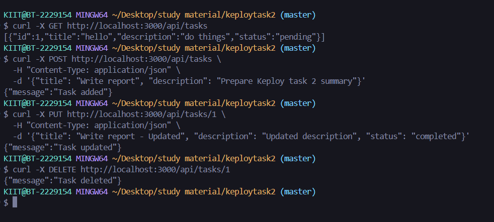
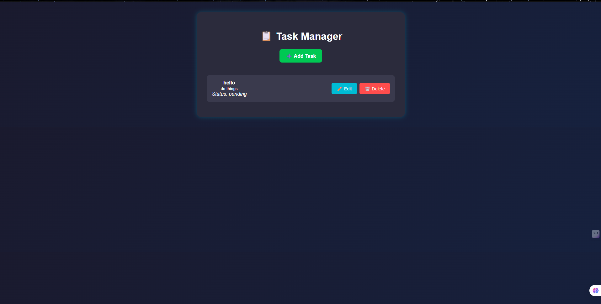
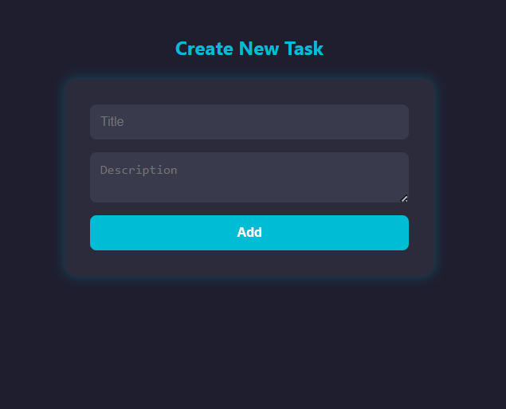
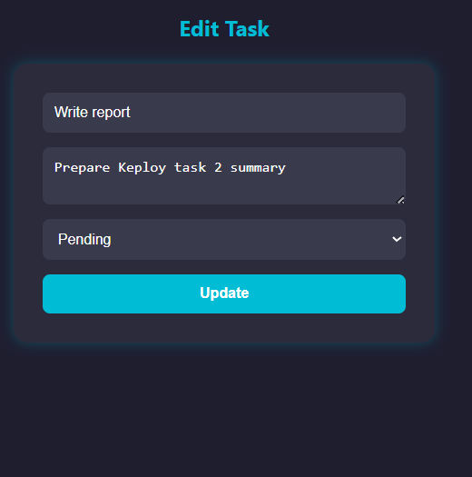
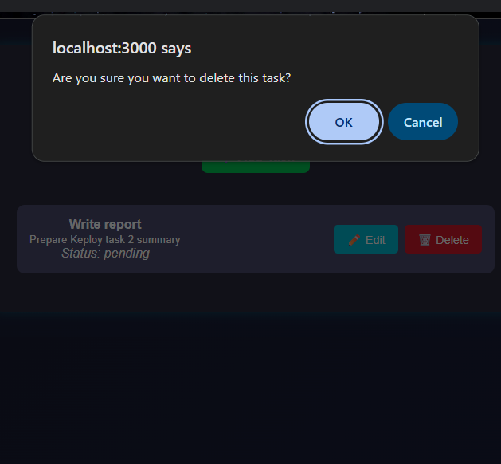

# 📋 Task Manager

A sleek, full-stack Task Manager web application built with **Node.js**, **Express**, **PostgreSQL**, **EJS**, and **Axios**.  
It features a custom-built RESTful API that allows users to **create**, **view**, **update**, and **delete** tasks with a clean and responsive UI.

---

## 🚀 Tech Stack

- **Backend**: Node.js, Express.js
- **Database**: PostgreSQL
- **Frontend**: EJS, HTML, CSS
- **HTTP Client**: Axios
- **Database Driver**: node-postgres (`pg`)

---

---

## ⚙️ Setup Instructions

### 1. Clone the repository

```bash
git clone https://github.com/your-username/task-manager.git
cd task-manager
```

### 2. Install dependencies

```bash
npm install
```

###Create and configure the database
  - Connect to PostgreSQL and run:
  - CREATE DATABASE taskdb;
```SQL
CREATE TABLE tasks (
  id SERIAL PRIMARY KEY,
  title TEXT NOT NULL,
  description TEXT,
  status TEXT DEFAULT 'pending'
);
```

### 4. Start the server
```bash
npm start
```

## 📸 Screenshots

### ✏️ Test Task


### 🏠 Home Page – Task List


### ➕ Add Task Form


### ✏️ Update Task Form


### ✏️ Delete Task Form



