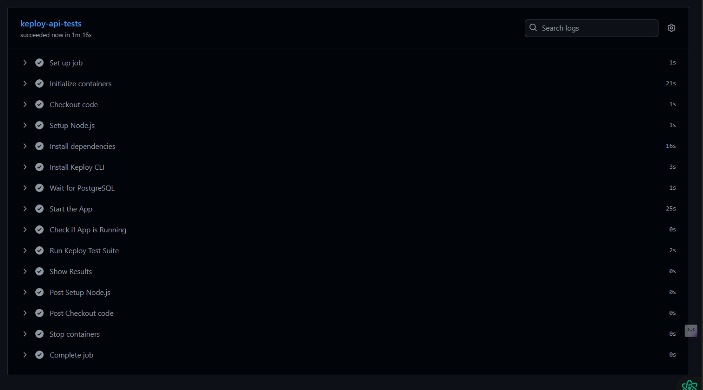
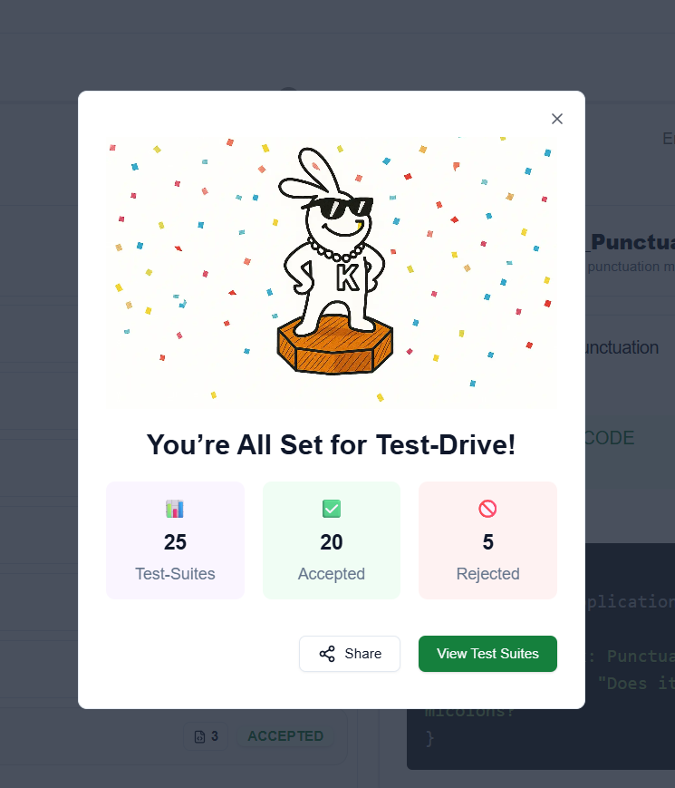
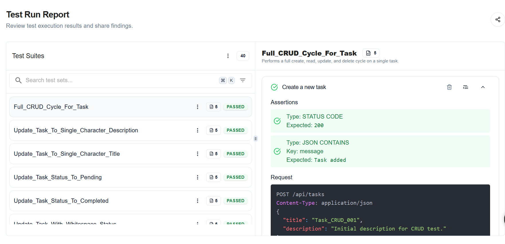
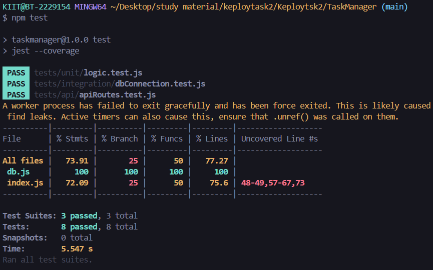

# 📋 Task Manager

A sleek, full-stack Task Manager web application built with **Node.js**, **Express**, **PostgreSQL**, **EJS**, and **Axios**.  
It features a custom-built RESTful API that allows users to **create**, **view**, **update**, and **delete** tasks with a clean and responsive UI.

---

## 🚀 Tech Stack

- **Backend**: Node.js, Express.js
- **Database**: PostgreSQL
- **Frontend**: EJS, HTML, CSS
- **HTTP Client**: Axios
- **Database Driver**: node-postgres (`pg`)
- **Jest** – Unit + integration testing
- **Supertest** – API endpoint testing

---

---

## ⚙️ Setup Instructions

### 1. Clone the repository

```bash
git clone https://github.com/your-username/task-manager.git
cd task-manager
```

### 2. Install dependencies

```bash
npm install
```

###Create and configure the database
  - Connect to PostgreSQL and run:
  - CREATE DATABASE taskdb;
```SQL
CREATE TABLE tasks (
  id SERIAL PRIMARY KEY,
  title TEXT NOT NULL,
  description TEXT,
  status TEXT DEFAULT 'pending'
);
```

### 4. Start the server
```bash
npm start
```

## ✅ Testing

This project uses **Jest** and **Supertest** for unit, integration, and API tests.

### 📦 Installed Dev Dependencies

```bash
npm install --save-dev jest supertest
```
###  Run Tests

```bash
npm test
```

###  Code Coverage
#### ✔️ Achieved >70% overall test coverage.

File      | % Stmts | % Branch | % Funcs | % Lines | Uncovered Line #s     
----------|---------|----------|---------|---------|-----------------------
All files |   73.91 |       25 |      50 |   77.27 |
db.js     |     100 |      100 |     100 |     100 |
index.js  |   72.09 |       25 |      50 |    75.6 | 48-49,57-67,73
----------|---------|----------|---------|---------|-----------------------


## 📸 Screenshots

### ✏️ Keploy.io Test Generation


### ✏️ Keploy.io Test Generation


### ✏️ Keploy.io Testing Dashboard 

### ✏️ Test Task


### 🏠 Home Page – Task List


### ➕ Add Task Form


### ✏️ Update Task Form


### ✏️ Delete Task Form


### ✏️ test



